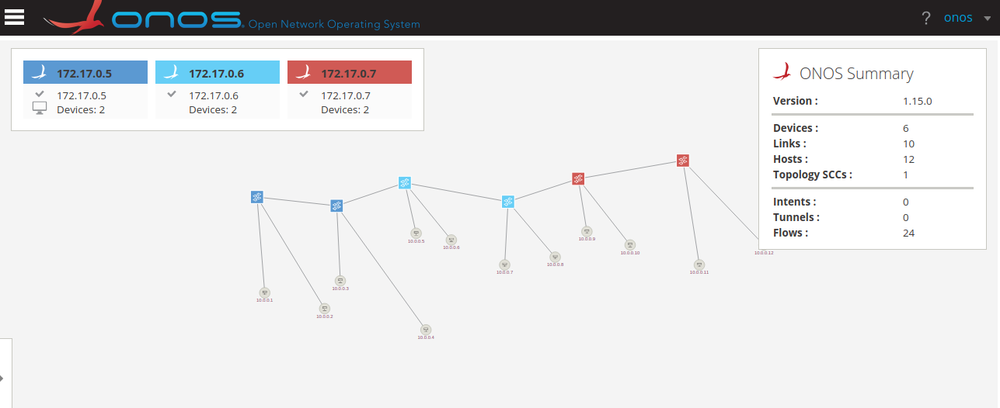
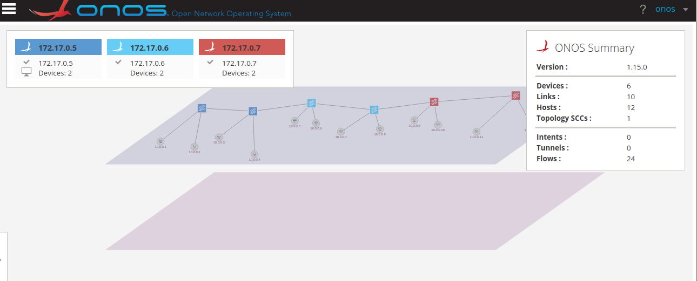
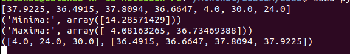
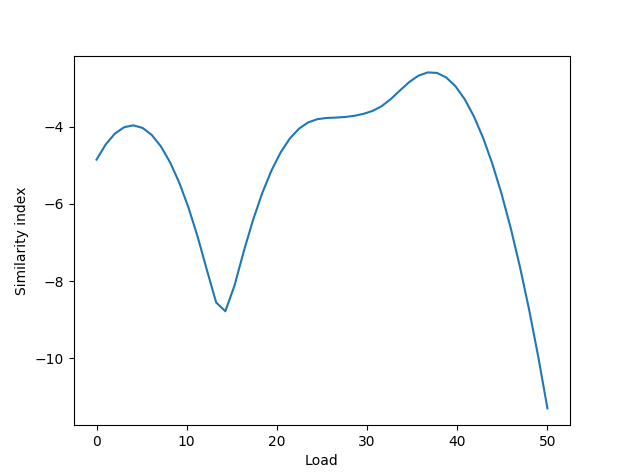
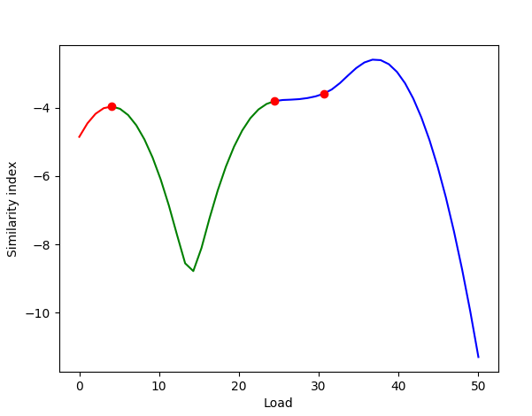
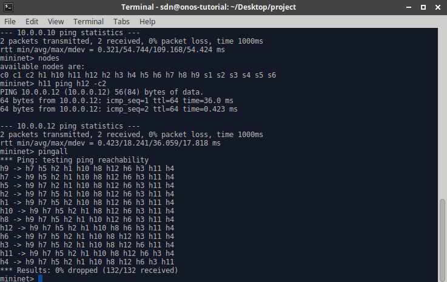

## For Latex

### TopoLogy Code

```
#!/usr/bin/python

from mininet.net import Mininet
from mininet.node import Controller, RemoteController, OVSController
from mininet.node import CPULimitedHost, Host, Node
from mininet.node import OVSKernelSwitch, UserSwitch
from mininet.node import IVSSwitch
from mininet.cli import CLI
from mininet.log import setLogLevel, info
from mininet.link import TCLink, Intf
from subprocess import call

def myNetwork():

    net = Mininet( topo=None,
                   build=False,
                   ipBase='10.0.0.0/8')

    info( '*** Adding controller\n' )
    c0=net.addController(name='c0',
                      controller=RemoteController,
                      ip='172.17.0.5',
                      protocol='tcp',
                      port=6653)

    c1=net.addController(name='c1',
                      controller=RemoteController,
                      ip='172.17.0.6',
                      protocol='tcp',
                      port=6653)

    c2=net.addController(name='c2',
                      controller=RemoteController,
                      ip='172.17.0.7',
                      protocol='tcp',
                      port=6653)

    info( '*** Add switches\n')
    s1 = net.addSwitch('s1', cls=OVSKernelSwitch)
    s3 = net.addSwitch('s3', cls=OVSKernelSwitch)
    s2 = net.addSwitch('s2', cls=OVSKernelSwitch)
    s4 = net.addSwitch('s4', cls=OVSKernelSwitch)
    s5 = net.addSwitch('s5', cls=OVSKernelSwitch)
    s6 = net.addSwitch('s6', cls=OVSKernelSwitch)

    info( '*** Add hosts\n')
    h9 = net.addHost('h9', cls=Host, ip='10.0.0.9', defaultRoute=None)
    h7 = net.addHost('h7', cls=Host, ip='10.0.0.7', defaultRoute=None)
    h5 = net.addHost('h5', cls=Host, ip='10.0.0.5', defaultRoute=None)
    h2 = net.addHost('h2', cls=Host, ip='10.0.0.2', defaultRoute=None)
    h1 = net.addHost('h1', cls=Host, ip='10.0.0.1', defaultRoute=None)
    h10 = net.addHost('h10', cls=Host, ip='10.0.0.10', defaultRoute=None)
    h8 = net.addHost('h8', cls=Host, ip='10.0.0.8', defaultRoute=None)
    h12 = net.addHost('h12', cls=Host, ip='10.0.0.12', defaultRoute=None)
    h6 = net.addHost('h6', cls=Host, ip='10.0.0.6', defaultRoute=None)
    h3 = net.addHost('h3', cls=Host, ip='10.0.0.3', defaultRoute=None)
    h11 = net.addHost('h11', cls=Host, ip='10.0.0.11', defaultRoute=None)
    h4 = net.addHost('h4', cls=Host, ip='10.0.0.4', defaultRoute=None)

    info( '*** Add links\n')
    net.addLink(s1, s2)
    net.addLink(s2, s3)
    net.addLink(s3, s4)
    net.addLink(s4, s5)
    net.addLink(s5, s6)
    net.addLink(s1, h1)
    net.addLink(h2, s1)
    net.addLink(s2, h3)
    net.addLink(h4, s2)
    net.addLink(s3, h5)
    net.addLink(h6, s3)
    net.addLink(s4, h7)
    net.addLink(h8, s4)
    net.addLink(s5, h9)
    net.addLink(h10, s5)
    net.addLink(s6, h11)
    net.addLink(h12, s6)

    info( '*** Starting network\n')
    net.build()
    info( '*** Starting controllers\n')
    for controller in net.controllers:
        controller.start()

    info( '*** Starting switches\n')
    net.get('s1').start([c0])
    net.get('s3').start([c1])
    net.get('s2').start([c0])
    net.get('s4').start([c1])
    net.get('s5').start([c2])
    net.get('s6').start([c2])

    info( '*** Post configure switches and hosts\n')

    CLI(net)
    net.stop()

if __name__ == '__main__':
    setLogLevel( 'info' )
    myNetwork()
```

### Topology Screenshot



### oblique topology Screenshot



### K-RANGE CODE
```
# %matplotib inline
# %pylab inline
from sklearn.neighbors.kde import KernelDensity
import numpy as np
from matplotlib import pyplot as plt
from scipy.signal import argrelextrema
import subprocess
import math

def k():
    op = subprocess.check_output(['awk', '$1~/cpu[0-9]/{usage=($2+$4)*100/($2+$4+$5); print usage}', '/proc/stat'])
    ar = op.split('\n')[0:-1]
    ar = list(map(float, ar))
    ar.extend([4.0,30.0,24.0])
    print(ar)
    X = np.array(ar).reshape(-1,1)
    kde = KernelDensity(kernel = 'gaussian', bandwidth=3).fit(X)
    s = np.linspace(0,50)
    e = kde.score_samples(s.reshape(-1,1))
    # plt(s,e)
    mi, ma = argrelextrema(e, np.less)[0], argrelextrema(e, np.greater)[0]
    print ("Minima:", s[mi])
    print ("Maxima:", s[ma])
    if(len(mi) < 2):
        ar.sort()
        mi = ar[0:len(ar)/2]
        ma = ar[len(ar)/2:]
        print(mi, ma)
        mi = list(map(int,mi))
        ma = list(map(int,ma))
    else:
        print (X[X < mi[0]], X[(X >= mi[0]) * (X <= mi[1])], X[X >= mi[1]]) 
    plt.plot(s,e)
    plt.xlabel('Load')
    plt.ylabel('Similarity index')
    plt.show()
    plt.plot(s[:mi[0]+1], e[:mi[0]+1], 'r',
    s[mi[0]:mi[1]+1], e[mi[0]:mi[1]+1], 'g',
    s[mi[1]:], e[mi[1]:], 'b',
    s[mi], e[mi], 'ro')
    plt.xlabel('Load')
    plt.ylabel('Similarity index')
    plt.show()
    # print(plot(s,e))

if __name__ == "__main__":
    k()
    input()
```

### KRANGE O/P

* Clusters



* Krange graph



* Krange graph showing cluster points




### Ping Test

